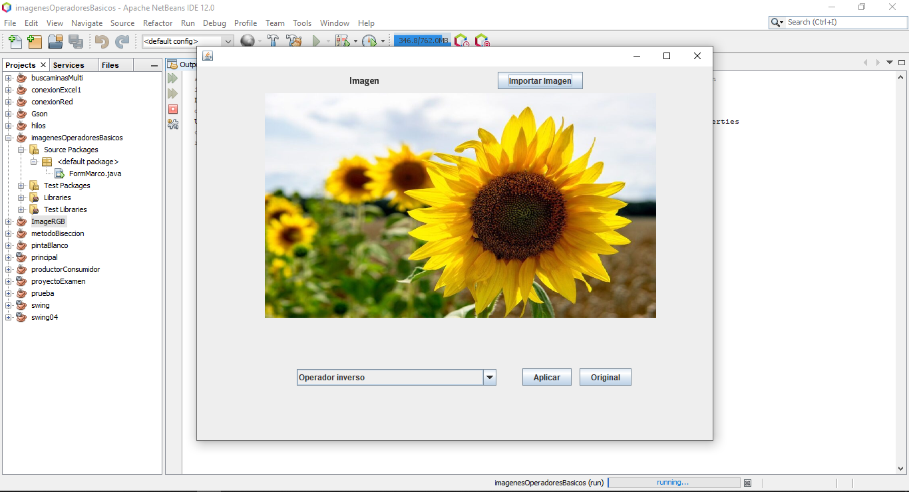

# OperacionesRelacionalesLogicasImagenes
## Implementacion de Operaciones relacionales y logicas a imagenes
  - Operador inverso    
  - Operador umbral     
  - Operador intervalo de umbral binario    
  - Operador intervalo de umbral binario inverso  
  - Operador umbral de la escala de grises   
  - Operador umbral de la escala de grises inverso  
  - Operador de extensión    
  - Operador reducción del nivel de gris  
  - Operador AND   
  - Operador OR   
  - Adiccion      
  - Sustraccion    

